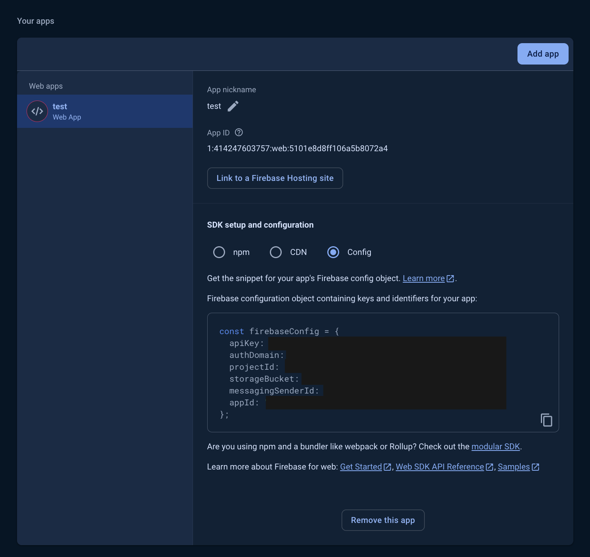
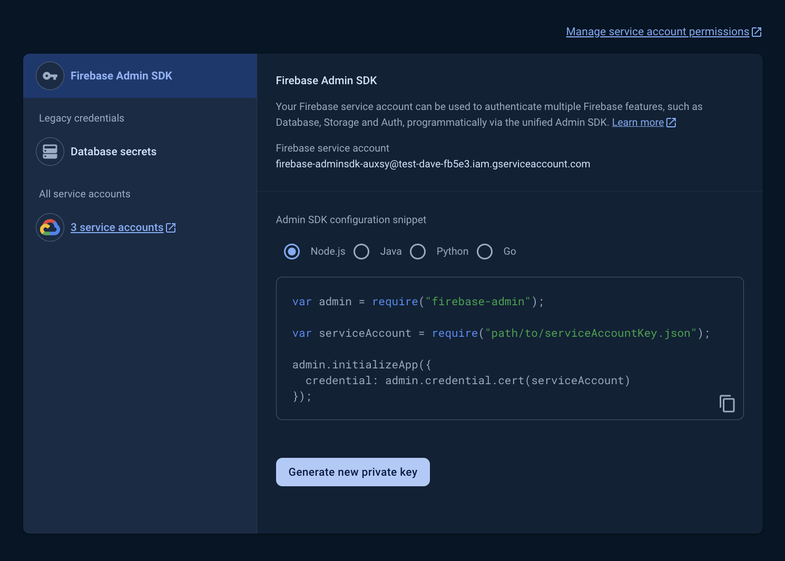

  

  A fast & fun way to build portable cloud-native applications

  
  
  

## Project Description

Verify Firebase ID Tokens with Nitric API middleware.

> Note: This is a demonstration of verifying ID tokens from the Firebase Client SDKs.

## Usage

### Step 1: Install Nitric

Follow the steps in the [installation guide](https://nitric.io/docs/installation)

### Step 2: Setup Firebase

To run this example you need a Firebase project. You can create one from the [Firebase console](https://console.firebase.google.com/).

Because this app contains both a frontend and a backend, it requires both Admin SDK and Client SDK credentials.

- You can get your client credentials from the Firebase project settings under the `General` tab

  

- You can get your admin credentials from the Firebase project settings under the `Service accounts` tab.

  

Update your client credentials in `frontend/src/lib/firebase.ts` and your admin service account credentials in your language specific backends `.env` as the `GOOGLE_APPLICATION_CREDENTIALS_JSON` variable with your own.

### Step 3: Add Google as a Sign-in Provider

Add Google as a Sign-in method in your Firebase project. This is in the [Firebase Console](https://console.firebase.google.com) under Build -> Authentication -> Sign-in method.

### Step 4: Run your Nitric project locally

Refer to the README located in the language specific version of this project.

## What about SSR?

This example demonstrates verifying ID Token from Firebase Client SDKS. However if you want to communicate Server-to-Server (for example with a SSR app) then you can [verify session cookies](https://firebase.google.com/docs/auth/admin/manage-cookies) instead.

You could modify this [Astro SSR example](https://github.com/kevinzunigacuellar/astro-firebase) and then pass the created session cookie via a header to your Nitric API. Then simply use the `verifySessionCookie` method in your middleware.

## About Nitric

[Nitric](https://nitric.io) is a framework for rapid development of cloud-native and serverless applications. Define your apps in terms of the resources they need, then write the code for serverless function based APIs, event subscribers and scheduled jobs.

Apps built with Nitric can be deployed to AWS, Azure or Google Cloud all from the same code base so you can focus on your products, not your cloud provider.

Nitric makes it easy to:

- Create smart serverless functions and APIs
- Build reliable distributed apps that use events and/or queues
- Securely store and retrieve secrets
- Read and write files from buckets

## Documentation

The full documentation is available at [nitric.io/docs](https://nitric.io/docs).

We're completely open-source and encourage [code contributions](https://nitric.io/docs/contributions).

## Get in touch

- Ask questions in [GitHub discussions](https://github.com/nitrictech/nitric/discussions)

- Find us on [Twitter](https://twitter.com/nitric_io)

- Send us an [email](mailto:maintainers@nitric.io)

- Jump into our [Discord server](https://nitric.io/chat)
