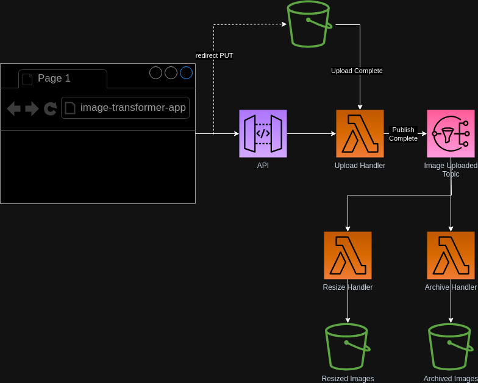

## Image Processor Example

This example demonstrates writing microservices that operate on files in response to an upload to a bucket. It also demonstrates the creation of repeatable patterns on infrastructure using nitric primitives see the [blob processor](./lib/blob-processor.ts) implementation for this project.

> NOTE: This application is also deployable to GCP and Azure.
